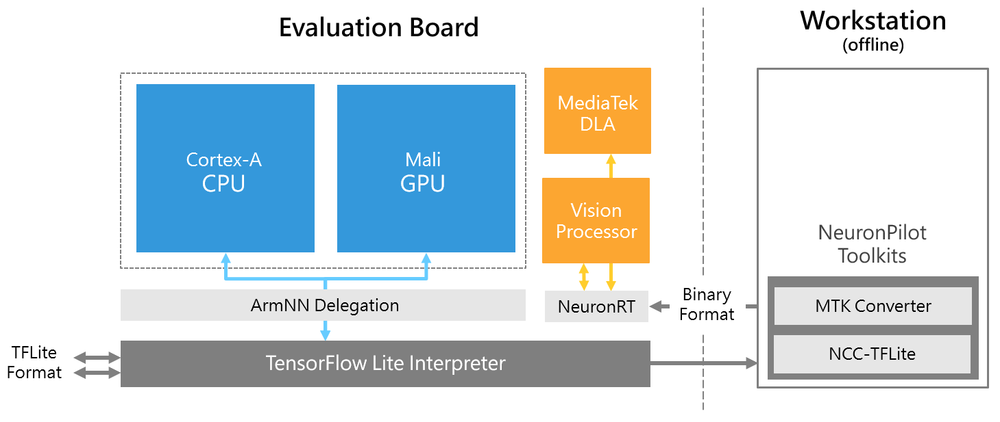

# How to Install Your Genio Board?
##### update : 2025/01 by ITRI (EOSL-R3)

The Genio Evaluation Kits are designed to provide developers with a robust platform for **Computer Vision** and **AIoT** applications. These kits support both Yocto and Ubuntu 22.04 operating systems, each offering unique advantages to cater to different development needs.

### Operating Systems:

* **Yocto**: Known for its high power performance, Yocto is ideal for developers who require a highly customizable and efficient OS. However, it may present a steeper learning curve due to its complexity.
* **Ubuntu 22.04**: This OS is more user-friendly and easier to develop on, making it suitable for developers who prioritize ease of use and rapid development.

### Device Tpye: 

|  Devices     | Genio 510     | Genio 700     | Genio 1200     |
| :----------: |:-------------:|:-------------:|:--------------:|
| **OS**            |  `Yocto`, `Ubuntu 22.04`            |   `Yocto`, `Ubuntu 22.04`            |   `Yocto`, `Ubuntu 22.04`            |
| **CPU**           |  `Cortex-A55`*4,`Cortex-A78`*2      |   `Cortex-A55`*6,`Cortex-A78`*2      |   `Cortex-A55`*4,`Cortex-A78`*4      |
| **GPU**           |  `Mali G57 MC2`                       |   `Mali G57 MC3`                   |   `Mali G57 MC5`                     |
| **APU**           | `MDLA 3.0`x1, `VP`x1                |   `MDLA 3.0`x1, `VP`x1               |   `MDLA 2.0`x2, `VP`x2               |
| **Performance**   | 0.15~2.8TOPs                        | 0.20~4.0TOPs                         | 0.25~4.8TOPs                         |
| **Power**         | 3.5~4.5W                            | 5~6W                                 | 6.2~7.2W                             |
| **Memory**        | 4GB LPDDR4                          | 8GB LPDDR4                           | 16GB LPDDR5                          |

## AI Development Resources

The diverse chipset of this system provides extensive application potential, while also indicating that developers will face a more complex development environment.

The diagram below illustrates the complete system resources and workflow. The workstation is used for installing the operating system on board and compiling trained models, all to enable efficient inference execution on the development board. You can follow the guidelines in this document to quickly set up both environments.

For more information, refer to the following resources:

1. [MediaTek IoT Yocto Developer Guide](https://mediatek.gitlab.io/aiot/doc/aiot-dev-guide/master/)
2. [Ubuntu on Genio documentation](https://mediatek.gitlab.io/genio/doc/ubuntu/index.html)

 

<a href="https://r300-ai.github.io/ITRI-AI-Hub/docs/genio-evk/step1.html"> 

[ Next >> Step1. Setup Tools ]
  
</a>

