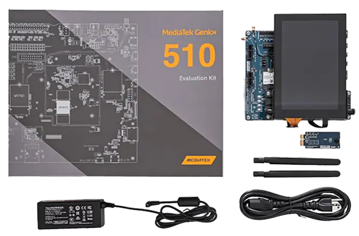

# How to Install Your Genio Board?
##### update : 2025/01 by ITRI (EOSL-R3)

|  Devices     | Genio 510     | Genio 700     | Genio 1200     |
| :----------: |:-------------:|:-------------:|:--------------:|
| **OS**            |  `Yocto`, `Ubuntu 22.04`            |   `Yocto`, `Ubuntu 22.04`            |   `Yocto`, `Ubuntu 22.04`            |
| **Chipsets**      |  `Cortex-A`, `Mali GPU`, `MDLA 3.0` |   `Cortex-A`, `Mali GPU`, `MDLA 3.0` |   `Cortex-A`, `Mali GPU`, `MDLA 2.0` |
| **Performance**   | 0.15~2.8TOPs                        | 0.20~4.0TOPs                         | 0.25~4.8TOPs                         |
| **Power**         | 3.5~4.5W                            | 5~6W                                 | 6.2~7.2W                             |
| **Memory**        | 4GB LPDDR4                          | 8GB LPDDR4                           | 16GB LPDDR5                          |

## Process to delegate

TFLite
NeuronPilot
ArmNN
NeuronRT

[1] [MediaTek IoT Yocto Developer Guide](https://mediatek.gitlab.io/aiot/doc/aiot-dev-guide/master/)
[2] [Ubuntu on Genio documentation](https://mediatek.gitlab.io/genio/doc/ubuntu/index.html)