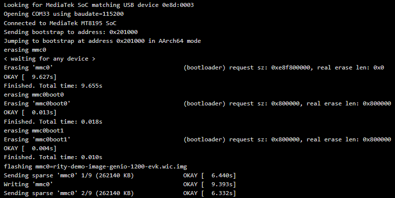

# Genio EVK Setup Guide
##### update : 2025/01 by ITRI (EOSL-R3)

> ### Prerequisites
> * An x86_64 Workstation which **Flash Tools** and **NeuronPilot** installed.
> * One of the following boards: **Genio510**, **Genio700**, or **Genio1200 EVK**, along with a power cable.
> * A **USB to Micro USB cable** to connect the workstation and the board.

## Flashing Pre-built Image to Board

### Step 1: Download Compatible Pre-built Image to Workstation
Choose one of the following options. The Board Support Packages (BSPs) are already included in `Yocto`. For `Ubuntu`, you need to install the BSPs manually.

| OS\ Device    | Genio510  | Genio700 | Genio1200 |
|---------------|-----------|----------|-----------|
| Yocto         |[[Image]]() | [[Image]]() | [[Image]]() | 
| Ubuntu        |[[Image]](), [[Firmware]]() | [[Image]](), [[Firmware]]() | [[Image]](), [[Firmware]]() |

### Step 2: Extract the Downloaded Image
Extract the downloaded image using the following command:

```bash
$ sudo tar -zxvf <IMAGE>.tar.gz -C <IMAGE_PATH>

# If you are using Ubuntu, please run the following command subsequently
$ sudo tar --strip-components=1 -xvf <BOOT_FIRMWARE>.tar.gz -C <IMAGE_PATH>/<IMAGE>
```

### Step 3: Connecting Board to Workstation
Follow the steps in the official documentation [HERE](https://mediatek.gitlab.io/aiot/doc/aiot-dev-guide/master/sw/yocto/get-started/connect.html) to connect the board to your workstation.

  1. Connect the board to your host machine using a USB cable.
  2. Ensure the board is powered on.

### Step 4: Launch genio-flash Tool
Navigate to the directory containing the extracted image files by executing:

```bash
$ cd <IMAGE_PATH>/<IMAGE>
```

### Step 5: Match the Genio Board using Flash Tools

Activate the image flasher and wait for the board to match by executing these commands:

```bash
# for Yocto image
$ genio-flash --load-dtbo gpu-mali.dtbo --load-dtbo apusys.dtbo --load-dtbo video.dtbo

# for Ubuntu image
$ genio-flash
```

### Step 6: Boot the Board into Download Mode

press and hold the **Download** button, then tap the **RST** button on your board. Refer to the layout [HERE](https://mediatek.gitlab.io/aiot/doc/aiot-dev-guide/master/sw/yocto/get-started/connect.html). Keep holding the Download button until the log message `Erasing mmc0` appears.

<div align="center">

</div>

### Step 7: Verify Installation
To confirm the board has booted into the operating system after flashing:

  1. Disconnecting and reconnecting the power cable.
  2. Press **PWR** on your board.
  3. Review the boot log and check the operating system has started successfully.

　
<br>
<div align="right">
<a href="https://r300-ai.github.io/ITRI-AI-Hub/docs/genio-evk/step3.html"> 

[ Next >> Step3. Install Packages ]
  
</a>
</div>
