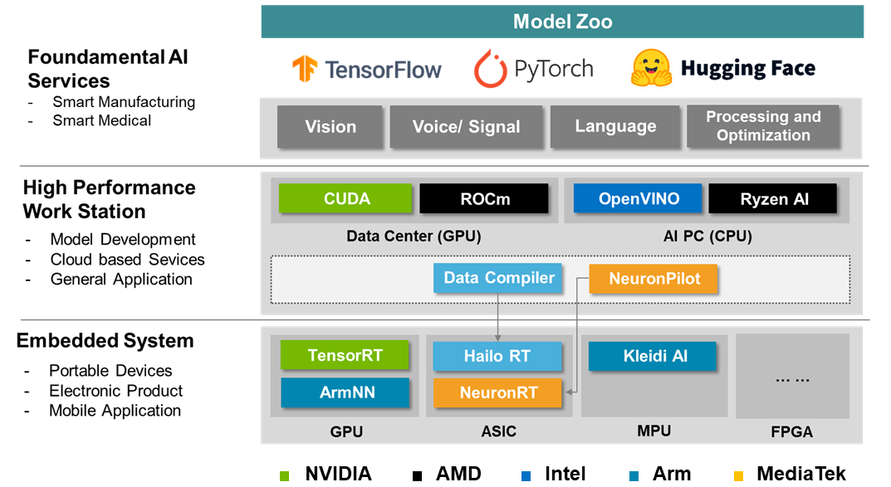

# Get Started

 Before selecting an embedded processor for your application and system, we recommend that you find a case study or similar implemented model in Model Zoo, and then select the appropriate Evaluation Kit based on its performance benchmarks on different types of processors.

In the following documents, we provide software installation guidelines related to Work Station and Evaluation Kits to meet the basic needs of developing embedded AI:

* **Work Station**: This term refers to the host environment used to develop and train AI models. Typically, this environment is separate from the embedded processor because the internal structure of the model must remain dynamic at this stage, and therefore a more versatile graphics processor must be used for training and compilation.
    > **Converter Tools**: This term refers to the process of converting each computational step into binary instructions for a specific DLA after the model has been developed. This process usually involves a series of steps such as simplification and quantisation, and is therefore usually performed on a workstation or large server.

* **Evaluation Kits:**: Embedded System
    > Runtime APIs: these APIs enable developers to perform reasoning on embedded systems using programming languages such as Python, C#, etc. and optimise the model's computational process through DLAs, thus reducing the execution time of the application and the energy consumption per unit of computation.
  
## **Platform Overview**

Below is a list of currently supported options:

### NVIDIA Jetson Series

The NVIDIA Jetson series of embedded systems is designed for high-performance computing, suitable for AI and machine learning applications. This series all running on the <strong>Ubuntu</strong> operating system.

|  Devices     | Orin Nano     | Orin NX          | AGX Xavier        | AGX Orin          |
|:------------:|:-------------:|:----------------:|:-----------------:|:-----------------:|
| **Chipsets**     | NVIDIA Orin         | NVIDIA Orin         | NVIDIA Xavier     | NVIDIA Orin          |
| **Architecture** | arm64               | arm64               | arm64             | arm64                |
| **CPU**          | 6-core Cortex-A78AE | 8-core Cortex-A78AE | 8-core ARM v8.2   | 12-core Cortex-A78AE |
| **GPU**          | Ampere (1024-core)  | Ampere (1024-core)  | Volta (512-core)  | Ampere (2048-core)   |
| **Power**        | 5~15W               | 10~25W              | 10~30W            | 15~60W               |
| **Memory**       | 4GB/8GB LPDDR5      | 8GB/16GB LPDDR5     | 32GB LPDDR4x      | 32GB/64GB LPDDR5     |
 
### MediaTek Genio Series

The MediaTek Genio series of embedded systems is meticulously engineered for versatile applications, offering an optimal balance between performance and power efficiency. This series fully supports the <strong>Ubuntu 22.04</strong> operating system, with the primary distinctions being the types of NPUs. For fundamental image processing requirements, the <strong>Genio 350</strong> suffices; the <strong>Genio 510</strong> and <strong>Genio 700</strong> support the most extensive range of AI operators. The <strong>Genio 1200</strong> is primarily intended for scenarios requiring high CPU and GPU utilization and basic AI operations, but it is not capable of delegating more complex models (e.g., YOLO) to the NPU for computation.

|  Devices     | Genio 350    | Genio 510     | Genio 700     | Genio 1200     |
| :----------: |:------------:|:-------------:|:-------------:|:--------------:|
| **Chipsets** |  MT8365      |  MT8385       |   MT8395      |   MT8396       |
| **Architecture** | arm64    | arm64         | arm64         | arm64          |
| **CPU**      | Cortex-A53   | Cortex-A73/A53 | Cortex-A76/A55 | Cortex-A78/A55 |
| **GPU**      | Mali-G52     | Mali-G57      | Mali-G57      | Mali-G57       |
| **NPU**      |      --      | MDLA-3.0      | MDLA-3.0      | MDLA-2.0       |
| **Power**    | 3~5W         | 5~10W         | 7~15W         | 10~20W         |
| **Memory**   | 2GB/4GB LPDDR4 | 4GB/8GB LPDDR4 | 4GB/8GB LPDDR4 | 8GB/16GB LPDDR5 |

The Genio 1200 is also available as a lighter board (ADLINK I-Pi SMARCs 1200) with the Yocto operating system.

### ARM Raspberry Pi Series

The ARM RaspberryPi series is an affordable and popular choice for embedded systems, ideal for education, DIY projects, and lightweight applications. This series all running on the <strong>Raspbian</strong> operating system.

|  Devices   | Gen-3        | Gen-4        | Gen-5         |
|:----------:|:------------:|:------------:|:-------------:|
| **Chipsets**     | BCM2837      | BCM2711      | BCM2712       |
| **Architecture** | arm64        | arm64        | arm64         |
| **CPU**          | Cortex-A53   | Cortex-A72   | Cortex-A76    |
| **Power**        | 2.5~5W       | 3~6W         | 4~8W          |
| **Memory**       | 1GB LPDDR2  | 2GB/4GB/8GB LPDDR4 | 4GB/8GB LPDDR4 |
