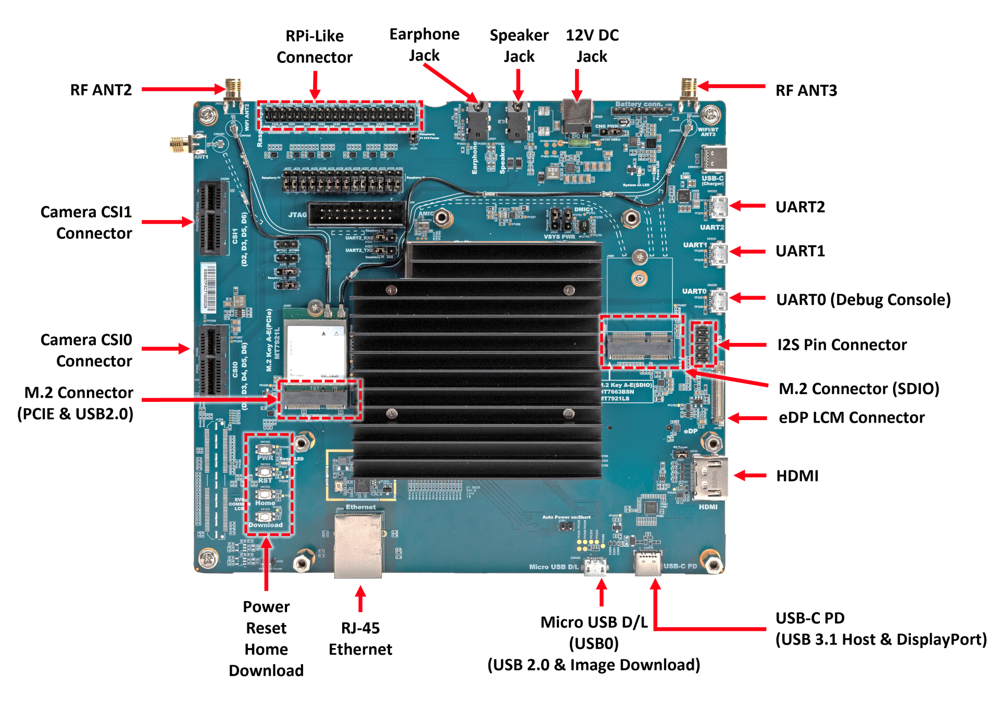
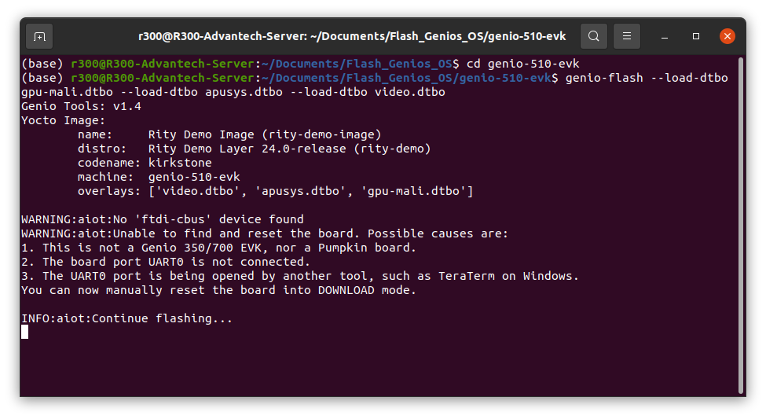
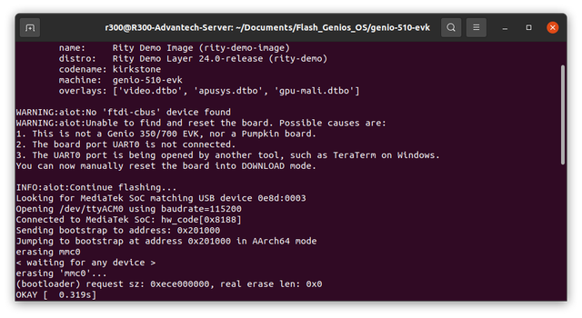

# Getting Started with MediaTek Genios Evaluation Kit

* [MediaTek IoT Yocto Developer Guide](https://mediatek.gitlab.io/aiot/doc/aiot-dev-guide/master/)
* [Ubuntu on Genio Documents](https://mediatek.gitlab.io/genio/doc/ubuntu/index.html)

### Prerequisites

* To install the AIoT Tools (include `aiot-config`, `aiot-flash`, `aiot-board`), you should use **Ubuntu 22.04** LTS host system.
* Be prepared with the **Genio-350/ 510/700/ 1200 EVK** board, power cable and USB to Micro cable.

## Make Sure Flash Tools Working on Host

> To install Genio Tools on a Linux host, you need:
> * Python 3.8 or later
> * pip3 20.3 or later
> * Git 1.8 or later

**Step 1.** Install the required packages.
```
$ sudo apt update && sudo apt upgrade -y
$ sudo apt-get install gawk wget git diffstat unzip texinfo gcc build-essential chrpath socat cpio python3 python3-pip python3-pexpect xz-utils debianutils iputils-ping python3-git python3-jinja2 libegl1-mesa libsdl1.2-dev pylint xterm python3-subunit mesa-common-dev
```
**Step 2.** Install Fastboot and setup the environments.
```
$ sudo apt-get install android-tools-adb android-tools-fastboot
```
**Step 3.** Install USB Driver and setup the environments.
```
$ echo 'SUBSYSTEM=="usb", ATTR{idVendor}=="0e8d", ATTR{idProduct}=="201c", MODE="0660", $ GROUP="plugdev"' | sudo tee -a /etc/udev/rules.d/96-rity.rules
$ echo -n 'SUBSYSTEM=="usb", ATTR{idVendor}=="0e8d", ATTR{idProduct}=="201c", MODE="0660", TAG+="uaccess" SUBSYSTEM=="usb", ATTR{idVendor}=="0e8d", ATTR{idProduct}=="0003", MODE="0660", TAG+="uaccess" SUBSYSTEM=="usb", ATTR{idVendor}=="0403", MODE="0660", TAG+="uaccess" SUBSYSTEM=="gpio", MODE="0660", TAG+="uaccess" ' | sudo tee /etc/udev/rules.d/72-aiot.rules
$ sudo udevadm control --reload-rules
$ sudo udevadm trigger
$ sudo usermod -a -G plugdev $USER
```
**Step 4.** Install Genio Tools and verify the installation.
```
$ pip3 install -U genio-tools
$ sudo usermod -a -G dialout $USER
```
```
$ genio-config
fastboot: OK
udev rules: OK
```

## Flashing Pre-built Image to Board

**Step 1.** Download compatible pre-built image from above table.

| OS\ Device    | Genio350  | Genio510  | Genio700 | Genio1200 |
|---------------|-----------|-----------|----------|-----------|
| Yocto         |[[Image]](https://itriaihub.blob.core.windows.net/prebuilt-images/MediaTek-Genio-Yocto/kirkstone_k5.15_v24.0_genio-350-evk_private_240626075838.tar.gz) | [[Image]](https://itriaihub.blob.core.windows.net/prebuilt-images/MediaTek-Genio-Yocto/kirkstone_k5.15_v24.0_genio-510-evk_private_240626080308.tar.gz) | [[Image]](https://itriaihub.blob.core.windows.net/prebuilt-images/MediaTek-Genio-Yocto/kirkstone_k5.15_v24.0_genio-700-evk_private_240626082053.tar.gz) | [[Image]](https://itriaihub.blob.core.windows.net/prebuilt-images/MediaTek-Genio-Yocto/kirkstone_k5.15_v24.0_genio-1200-evk_private_240626084538.tar.gz) |
| Ubuntu 22.04  |[[Image]](https://itriaihub.blob.core.windows.net/prebuilt-images/MediaTek-Genio-Ubuntu/genio350/genio-classic-server-2204-x09-20231004-131.tar.xz), [[Firmware]](https://itriaihub.blob.core.windows.net/prebuilt-images/MediaTek-Genio-Ubuntu/genio350/ubuntu-boot-firmware-genio-350-evk-v23.1.3.tar.gz) | [[Image]](https://itriaihub.blob.core.windows.net/prebuilt-images/MediaTek-Genio-Ubuntu/genio510/genio-classic-desktop-2204-20240322-185.tar.xz), [[Firmware]](https://itriaihub.blob.core.windows.net/prebuilt-images/MediaTek-Genio-Ubuntu/genio510/ubuntu-boot-firmware-genio-510-evk-v23.2.1.tar.gz) | [[Image]](https://itriaihub.blob.core.windows.net/prebuilt-images/MediaTek-Genio-Ubuntu/genio700/genio-classic-desktop-2204-x01-20231005-133.tar.xz), [[Firmware]](https://itriaihub.blob.core.windows.net/prebuilt-images/MediaTek-Genio-Ubuntu/genio700/ubuntu-boot-firmware-genio-700-evk-v23.1.3.tar.gz) | [[Image]](https://itriaihub.blob.core.windows.net/prebuilt-images/MediaTek-Genio-Ubuntu/genio1200/genio-classic-desktop-2204-x01-20231005-133.tar.xz), [[Firmware]](https://itriaihub.blob.core.windows.net/prebuilt-images/MediaTek-Genio-Ubuntu/genio1200/ubuntu-boot-firmware-genio-1200-evk-v23.1.3.tar.gz) |


**Step 2.** Connect the **Image Download** port on Board to the USB port on Host.
> We use Genio 510 as example to show where download port is. if you need check the configuration of others board, please check the documents below: 
> *　[[350-EVK layout]](https://mediatek.gitlab.io/aiot/doc/aiot-dev-guide/master/sw/yocto/get-started/connect/ports-g350-evk.html)
> * [[510/700-EVK layout]](https://mediatek.gitlab.io/aiot/doc/aiot-dev-guide/master/sw/yocto/get-started/connect/ports-g700-evk.html)
> * [[1200-EVK layout]](https://mediatek.gitlab.io/aiot/doc/aiot-dev-guide/master/sw/yocto/get-started/connect/ports-g1200-evk.html) 

<div align="center"></div>

**Step 2.** Unzip the image into `<IMAGE_PATH>` directory.

```
sudo tar -zxvf <IMAGE>.tar.gz -C <IMAGE_PATH>

# If you are using Ubuntu, please run following command
sudo tar --strip-components=1 -xvf <BOOT_FIRMWARE>.tar.gz -C <IMAGE_PATH>/<IMAGE>
```

**Step 3.**  Run following command and wait until the logs show up.

```
cd <IMAGE_PATH>/<IMAGE>

# for Yocto Image
genio-flash --load-dtbo gpu-mali.dtbo --load-dtbo apusys.dtbo --load-dtbo video.dtbo
# for Ubuntu Image
genio-flash
```

<div align="center"></div>

**Step 4.** Press and hold **Download** button and tap **RST** button on the board to start flashing.

<div align="center"></div>

> We recommand that you can install bellow extentions on board if you are using **Ubuntu**.
> * Gnome Desktop and Virtual Environment
>   * Disable Screen lock and Activate Automatic Login (important for changing monitor)
>   * Miniconda ([Installation Guide](https://docs.anaconda.com/miniconda/))
>   * WIFI driver ([[DWA-171]](https://github.com/CarlosSenobio/d-link-dwa-171-wifi-adapter-automatic-driver-installer)) 
> * Gstreamer & NeuronPilot
>   ```
>   git clone https://github.com/R300-AI/ITRI-AI-Hub.git
>   
>   # Genio 350
>   bash ITRI-AI-Hub/tools/setup_genio350.sh
>   # Genio 510
>   bash ITRI-AI-Hub/tools/setup_genio510.sh
>   # Genio 700
>   bash ITRI-AI-Hub/tools/setup_genio700.sh
>   # Genio 1200
>   bash ITRI-AI-Hub/tools/setup_genio1200.sh
>   ```
>   ```
>   # Reboot and verify the installation
>   sudo python3 /usr/share/neuropilot/benchmark_dla/benchmark.py --auto
>   ```