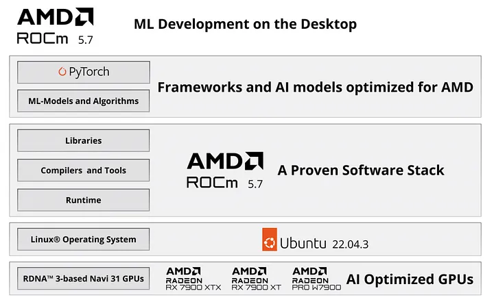

# Install AMD Radeon Driver on Ubuntu 22.04 LTS
##### update time: 2024/10

<div align="center"></div>

**Step 1**: Install AMD unified driver package repositories and installer script.
```bash
sudo apt update
wget https://repo.radeon.com/amdgpu-install/6.2.3/ubuntu/jammy/amdgpu-install_6.2.60203-1_all.deb
sudo apt install ./amdgpu-install_6.2.60203-1_all.deb
```

**Step 2**: Run the following command to install ROCm, add user to the render and reboot the system.
```bash
amdgpu-install -y --usecase=graphics,rocm
sudo usermod -a -G render,video $LOGNAME
sudo reboot
```

**Step 3**: Create a preference file to prioritize packages from the AMDGPU repository over system packages.
```bash
echo -e 'Package: *\nPin: release o=repo.radeon.com\nPin-Priority: 600' | sudo tee /etc/apt/preferences.d/rocm-pin-600
sudo apt install amdgpu-dkms
sudo reboot
```
**Step 4**: Check if the GPU is listed as an agent.
```bash
rocminfo
```

**Step 5**: Enter this command to install Torch and Torchvision for ROCm AMD GPU support
```
pip3 install torch torchvision torchaudio --index-url https://download.pytorch.org/whl/rocm6.1

python3 -c "import torch; print(torch.cuda.is_available())"
```
* **NOTE:** Latest PyTorch requires Python 3.8 or later.

### Appendix
* [Use ROCm on Radeon GPUs](https://rocm.docs.amd.com/projects/radeon/en/latest/docs/install/native_linux/install-radeon.html)
* [PyTorch -Get Started](https://pytorch.org/get-started/locally/)
