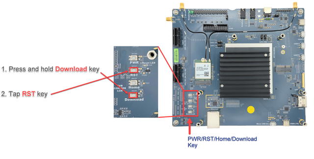

# Flash Image to Boards

## Genio-Flash

### **MediaTek Genio 350/510/700/1200 EVK**

**Step 1.** Connect the **Image Download** port (MicroUSB or Type-C) of your board to the USB port of the Flash Host. Here we will use Genio 510 EVK as an example.

<div align="center"></div>

**Step 2.** Unzip the image into `<IMAGE_PATH>` directory.

<div align="center"></div>

```
# for Yocto Image
sudo tar -zxvf <YOCTO_IMAGE>.tar.gz -C <IMAGE_PATH>
```
```
# for Ubuntu Image
sudo tar -zxvf <UBUNTU_IMAGE>.tar.xz -C <IMAGE_PATH>
sudo tar --strip-components=1 -xvf <BOOT_FIRMWARE>.tar.gz -C <IMAGE_PATH>/<UBUNTU_FOLDER>
```

**Step 3.**  Run following command and wait until the logs displayed.

```
# for Yocto Image
cd <IMAGE_PATH>/<YOCTO_IMAGE>
genio-flash --load-dtbo gpu-mali.dtbo --load-dtbo apusys.dtbo --load-dtbo video.dtbo
```
```
# for Ubuntu Image
cd <IMAGE_PATH>/<UBUNTU_IMAGE>
genio-flash
```
<div align="center"></div>

**Step 4.** Press and hlod Download button and tap RST button on the board to start flashing.

<div align="center"></div>