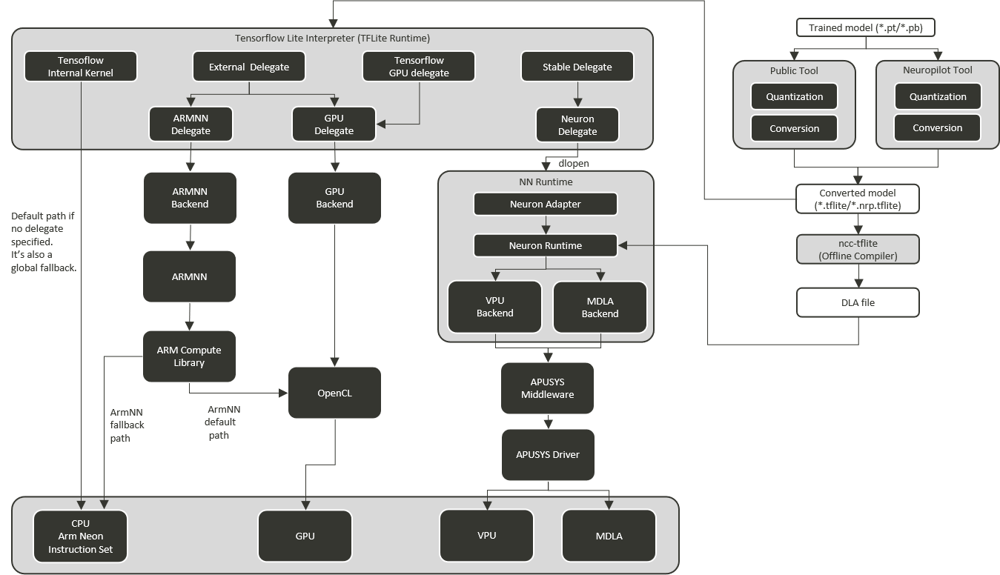

# ArmNN
##### update : 2024/10 by Markov Chen
<br>

<div align="center"></div>

## Notes
```bash
wget -O ArmNN-aarch64.tgz https://github.com/ARM-software/armnn/releases/download/v23.08/ArmNN-linux-aarch64.tar.gz
mkdir armnn
tar -xvf ArmNN-aarch64.tgz -C armnn

vim ~/.bashrc
#add this line to .bashrc
export LD_LIBRARY_PATH=<path_to_your_armnn_folder>

source ~/.bashrc
```
```bash
sudo ln ${LD_LIBRARY_PATH}/libarmnnDelegate.so.29.0 libarmnnDelegate.so.29
sudo ln ${LD_LIBRARY_PATH}/libarmnn.so.33.0 libarmnn.so.33
```
```
import tensorflow.lite as tflite
from tensorflow.lite.experimental import load_delegate

backend_options = ['CpuAcc', 'GpuAcc', 'GpuAcc,CpuAcc']

model = tflite.Interpreter(model_path = model_path, 
                           experimental_delegates = [
                                                    load_delegate(
                                                                   library = "${LD_LIBRARY_PATH}/libarmnnDelegate.so.29.0",
                                                                   options = {"backends": {"backends": backend_options[2], "logging-severity": "info"},
                                                                 )
                                                    ]
                          )

input_details, output_details = model.get_input_details(), model.get_output_details()
```
