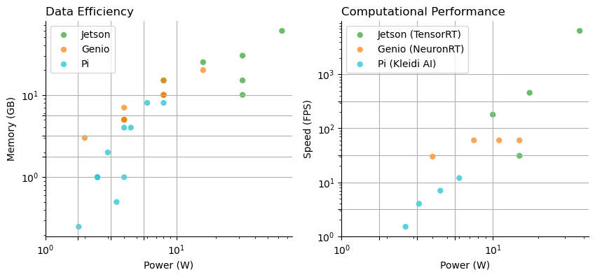

# Welcome to ITRI AI Hub Tutorials
##### update : 2025/01 by ITRI (EOSL-R3)

 ITRI AI Hub offers simple, fast, and commercialized Edge AI implementation solutions for enterprises and developers. Before selecting a system, we recommend evaluating which devices are suitable for your applications based on model type, computing power, memory, and energy efficiency. The diagram below summarizes the memory and computing power distribution of devices we selected, helping you compare them more intuitively with Model Zoo, open-source communities, or other custom models.

## **Development Flow Overview**

Overall, the model deployment process includes the following three stages:

<strong>Step1. Training</strong>

This stage involves the design and development of AI models, which are typically annotated, extended, and parameterized using the computing resources listed below. Alternatively, these steps can be skipped by using pre-trained models.
<ul>
    <li><a href="https://azure.microsoft.com/zh-tw">Cloud-hosted Data Center (e.g. Azure, AWS)</a></li>
    <li><a href="https://www.amd.com/zh-tw/products/software/rocm.html">Servers or Workstations with ROCm</a></li>
    <li><a href="https://developer.nvidia.com/cuda-toolkit">Servers or Workstations with CUDA</a></li>
</ul>

<strong>Step2. Compiling</strong>

To ensure that the model can execute efficiently on embedded systems, we need to use vendor-specific compilers to fine-tune parameters, optimize memory and computational resources, and generate binary files based on the chip architecture and instruction set.
<ul></ul>

<strong>Step3. Inference</strong>

Follow the instructions to configure the engine and operating environment for your specified chips, to deploy binary files and perform computations on the system.
<ul>
    <li><a href="https://r300-ai.github.io/ITRI-AI-Hub/docs/genio-evk.html">Genio Evaluation Kits</a></li>
    <li><a href="https://r300-ai.github.io/ITRI-AI-Hub/docs/hailo.html">Hailo AI Accelerator</a></li>
    <li><a href="https://r300-ai.github.io/ITRI-AI-Hub/docs/ryzen.html">Ryzen AI Processor</a></li>
    <li><a href="https://r300-ai.github.io/ITRI-AI-Hub/docs/jetson-evk.html">Jetson Evaluation Kits</a></li>
</ul>

Visiting "Developer Support" for more information

 

## **How to Build Your Own Application?**

* [Train Your Own Model]()
* [Pre-trained Model from Model Zoo or Third-Party]()