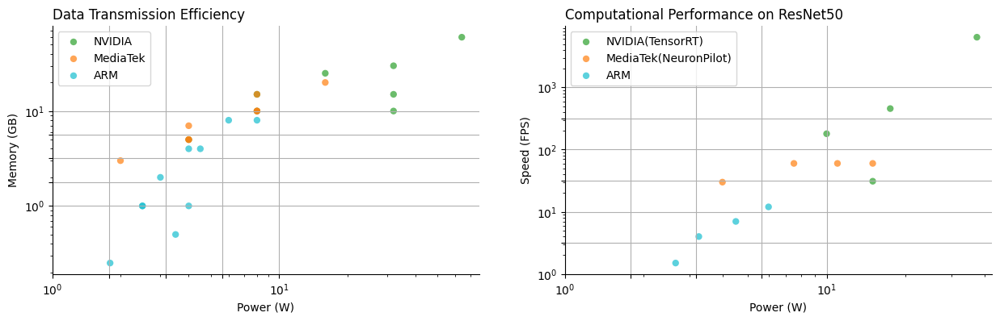

# Welcome to ITRI AI Hub Document

The ITRI AI Hub provides a comprehensive AI infrastructure solution to help enterprises construct an portable AI system with <b>Compliant, Secure,</b> and <b>High Energy Efficiency</b>. Developers can find the optimal computing units on this platform for implementing various sophisticated applications.

 Imagine how important an Edge AI with high endurance is in a jungle with no internet connection. Imagine being alone in such a situation with only your digital assistant, but unable to use its full functionality due to the lack of internet connectivity. Embedded AI is able to efficiently process data and perform tasks on a local device, meaning that even when the internet is unavailable, your digital assistant can still identify dangerous animals and plants, provide voice survival guides, and monitor physiological conditions, among other key functions. On the other hand, a laptop workstation is an alternative solution, but it may face challenges such as limited battery life. In contrast, using cloud-based AI involves bottlenecks such as finding network signals, connecting to the network, synchronising data and requesting cloud services, all of which may not be completed in real time during such emergencies, thereby compromising your safety and convenience.

## **Designed for AI Applications Everywhere**

 As illustrated in the figure below, our AI application services encompass a wide range of functionalities across various domains, including Vision, Voice/Signal, Language, and Processing and Optimization. In the Vision domain, our services offer advanced capabilities such as image classification, object detection, character recognition, and keypoint recognition. These functionalities enable precise analysis and interpretation of visual data. For Voice and Signal processing, we provide robust solutions for text-to-speech and speech-to-text conversion, decision control, timing anomaly analysis, and time series analysis. These services facilitate effective communication and signal processing. In the Language domain, our AI services include sophisticated text comprehension, entity extraction, and question-answering systems. These capabilities enhance natural language understanding and interaction. Our Processing and Optimization services feature dynamic planning, reinforcement learning control, and search engine optimization. These functions are designed to improve operational efficiency and decision-making processes.

 

(待修正為1. Vision 2. Voice/ Signal 3. Language 4. Processing and Optimization四項)

## **What Can We Do?**

This statement does not undermine the necessity of cloud computing and computational workstations; however, it acknowledges that embedded AI can be more reliable and energy-efficient in certain scenarios. It is imperative that we thoroughly understand the entire application environment and define the basic requirements of each functional unit, to determine where each microservice in the system should be delegated and the carriers. Furthermore, we are committed to integrating the latest embedded hardware solutions and conducting feasibility assessments for porting these functions. Our comprehensive reports will enable organizations to swiftly implement these advanced AI options into their systems, ensuring that private data remains close to the client host. Therefore, we build the AI Hub to help enterprises find more rational use of computing costs and resources. The following figure roughly shows the currently supported edge system inference benchmarks. These results are achieved through the engines of each major processor. You can evaluate the configuration of edge devices based on underlying transfer efficiency, power consumption, and computational speed.
 

 

 

<a href="https://r300-ai.github.io/ITRI-AI-Hub/docs/pages/get-started.html"> >> Next: Get Started</a>

